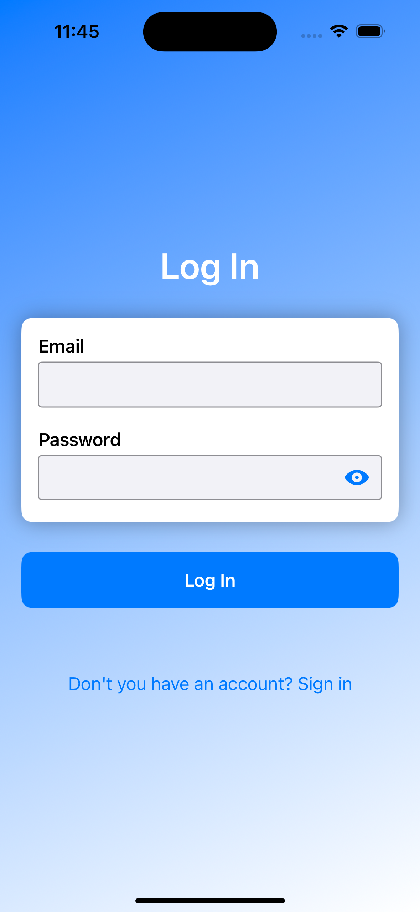
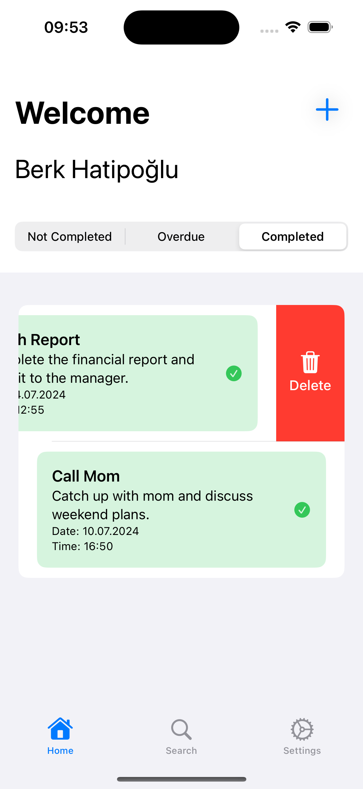

Welcome to your new Reminder App, the perfect tool to help you stay organized, manage your tasks efficiently, and never miss a deadline again!

This application was developed with MVVM (Model-View-ViewModel) architecture. Lottie was used for animations, and Firebase was used for basic operations such as application management, usage tracking, storage, and notification delivery.

Once we log in to the application, the application remembers us and even if we close the application, we do not need to log in again. "UserDefaults" was used for this. Here, the user's "id" value and whether it is in "Login" status are kept.

When we open the application, a welcome screen awaits us. If we have logged into the application before, we will automatically pass this screen and the sign up/login screens and be directed to the home page.

   &nbsp;&nbsp;&nbsp;&nbsp;&nbsp;&nbsp;&nbsp;&nbsp;
   &nbsp;&nbsp;&nbsp;&nbsp;&nbsp;&nbsp;&nbsp;&nbsp;
  

 After clicking the "Sign Up" button, it directs us to the Sign Up screen. If we are a member before, we can go to the "Log In" page and log in. We can see the password we wrote by clicking on the eye button here. 
  If I click again it will return to its previous state. If you have previously registered with the same email, a new registration will not be created.

   &nbsp;&nbsp;&nbsp;&nbsp;&nbsp;&nbsp;&nbsp;&nbsp;
  

 After logging in successfully, we will be directed to "Homepage". On this page, we see the reminders that are not completed, overdue and completed. We can switch between them and see which ones are in the status we want.

   &nbsp;&nbsp;&nbsp;&nbsp;&nbsp;&nbsp;&nbsp;&nbsp;
   &nbsp;&nbsp;&nbsp;&nbsp;&nbsp;&nbsp;&nbsp;&nbsp;
  

   &nbsp;&nbsp;&nbsp;&nbsp;&nbsp;&nbsp;&nbsp;&nbsp;
   &nbsp;&nbsp;&nbsp;&nbsp;&nbsp;&nbsp;&nbsp;&nbsp;
  

 We can delete the Reminder by sliding it to the left. 

   &nbsp;&nbsp;&nbsp;&nbsp;&nbsp;&nbsp;&nbsp;&nbsp;
   

 We can add a new reminder by clicking the “+” button on the top right. 

   &nbsp;&nbsp;&nbsp;&nbsp;&nbsp;&nbsp;&nbsp;&nbsp;
   

  

 We can delete reminder here.We can see the details of the created "reminder" by clicking on it. We can change the information we entered when creating it. We can also change the "Status" value. 

   &nbsp;&nbsp;&nbsp;&nbsp;&nbsp;&nbsp;&nbsp;&nbsp;
  

 We can view the reminders we have previously created on the search page. Thanks to the search bar, we can find the reminders we created more easily. 

   &nbsp;&nbsp;&nbsp;&nbsp;&nbsp;&nbsp;&nbsp;&nbsp;
  

 On the settings page we can go to the account info page. We can change the dark/light mode of the application. Additionally, we can exit. 

   &nbsp;&nbsp;&nbsp;&nbsp;&nbsp;&nbsp;&nbsp;&nbsp;
  

 We can see the information about our account on the user information page. We can update our information by clicking the Edit Informatin button. We can change our password from the Change Password button. 

   &nbsp;&nbsp;&nbsp;&nbsp;&nbsp;&nbsp;&nbsp;&nbsp;
   &nbsp;&nbsp;&nbsp;&nbsp;&nbsp;&nbsp;&nbsp;&nbsp;
   &nbsp;&nbsp;&nbsp;&nbsp;&nbsp;&nbsp;&nbsp;&nbsp;
   &nbsp;&nbsp;&nbsp;&nbsp;&nbsp;&nbsp;&nbsp;&nbsp;
   &nbsp;&nbsp;&nbsp;&nbsp;&nbsp;&nbsp;&nbsp;&nbsp;
  

If you want to run the project yourself, do not forget to add the GoogleService-Info.plist file to the project. There are two settings you need to make through Firebase.
  
1- Under "Authentication", you must select the Email/Password option as the "Sign-in method".

2- You must select "Firebase Storage" as Storage. The important thing here is the "Rules" title. If we do not edit this place, we cannot perform operations in the application.
Rules are as follows:
  
    service cloud.firestore {
     match /databases/{database}/documents {
  
       // Access to user documentation
       match /users/{userId} {
         allow read, write: if request.auth != null;
       }
    
       // Access reminder documents
       match /reminders/{reminderId} {
         allow read, write: if request.auth != null;
       }
     }
    }

